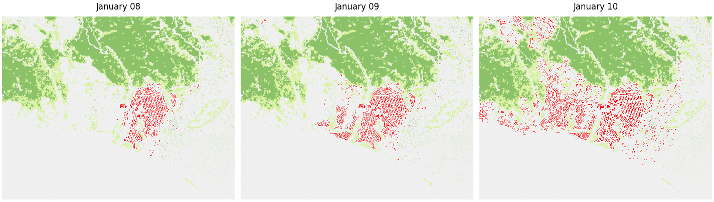

# Urban Fire Spread Prediction Using Graph Attention Networks

The image below illustrates the progression of the Palisades fire in Los Angeles over a three-day period.


This project uses a Graph Attention Network (GAT) to predict urban fire spread during the Palisades fire.
**Model Input:**
- Fire damage on Day 1
- Wind magnitudes in the x and y directions
- Vegetation data

**Model Output:**
- Predicted fire damage on Day 2


## Setup Instructions

1. Clone this repository into a directory of your choice. Cd into said repository.

2. Install Requirements
   Python Version Used: 3.12. Recommended to activate pyvenv before installing requirements.
    ```bash
    pip install -r requirements.txt
    ```

3. Download Required Datasets
    - **Palisades Fire Data**: [palisades-fire-building-damage-assessment](https://data.humdata.org/dataset/palisades-fire-building-damage-assessment)
    - - Download all 4 files
    - **SCLC Land Cover**: [sc-urban-land-cover-classification](https://data.mendeley.com/datasets/zykyrtg36g/2)
    - **FBFM13 Fuel Model**: [ca-landfire-fuel-model](https://landfire.gov/data/FullExtentDownloads)
    - - Select CONUS LF 2023 and extract the file LC23_F13_240.tif from the zip file

    Place the datasets inside the `data/` folder.

4. Create CDS API Key
   To download the wind data for our experiment, follow the instructions at this link: [CDSAPI Setup](https://cds.climate.copernicus.eu/how-to-api)
   - Setup the CDS API personal access token
   - Install the CDS API Client

5. Extract Fire Extent Geometry
    ```bash
    python data/extract_fire_geojson.py
    ```

6. Generate Vegetation and Wind Layers
    ```bash
    python data/vegetation_layer.py
    python data/wind_layers.py
    ```

7. Stack Daily Fire Inputs
    ```bash
    python data/stack_fire_inputs.py
    ```

8. Train and Validate GNN Model. Note: will take a while to train and produce predictions.
    ```bash
    python gnn.py
    ```
